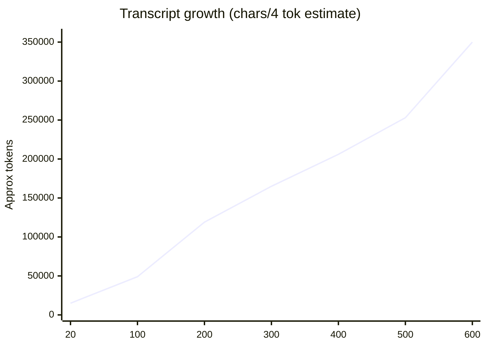
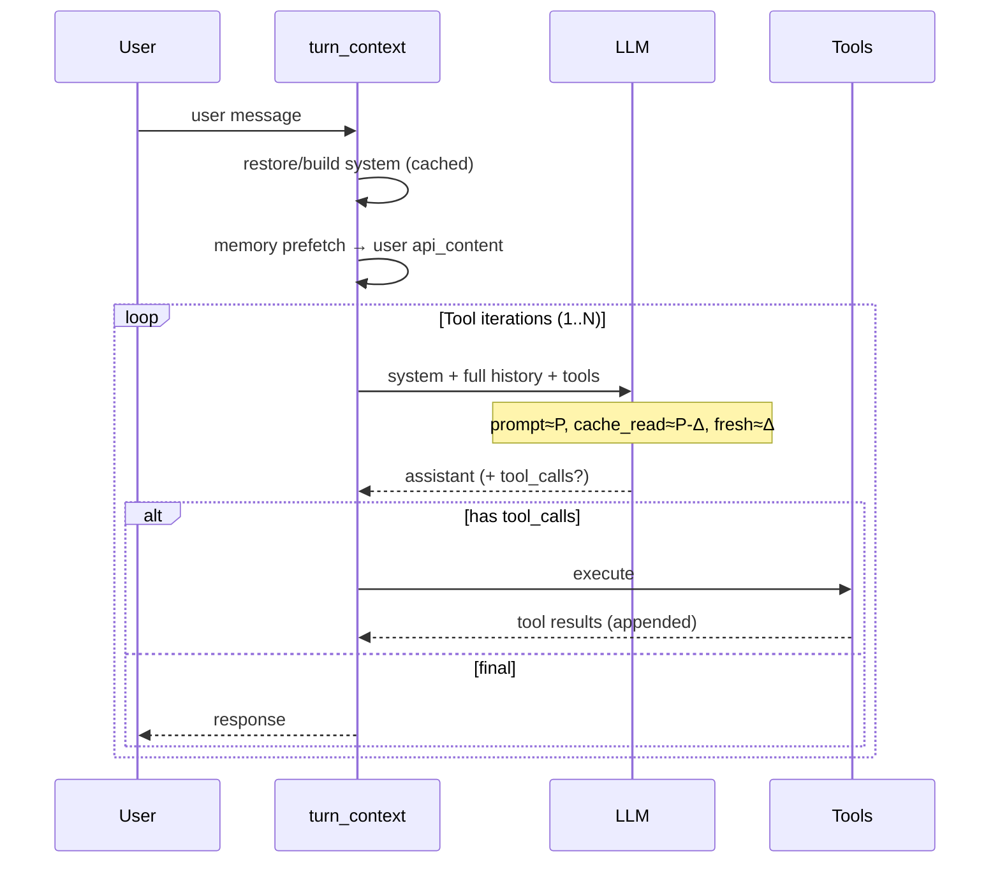
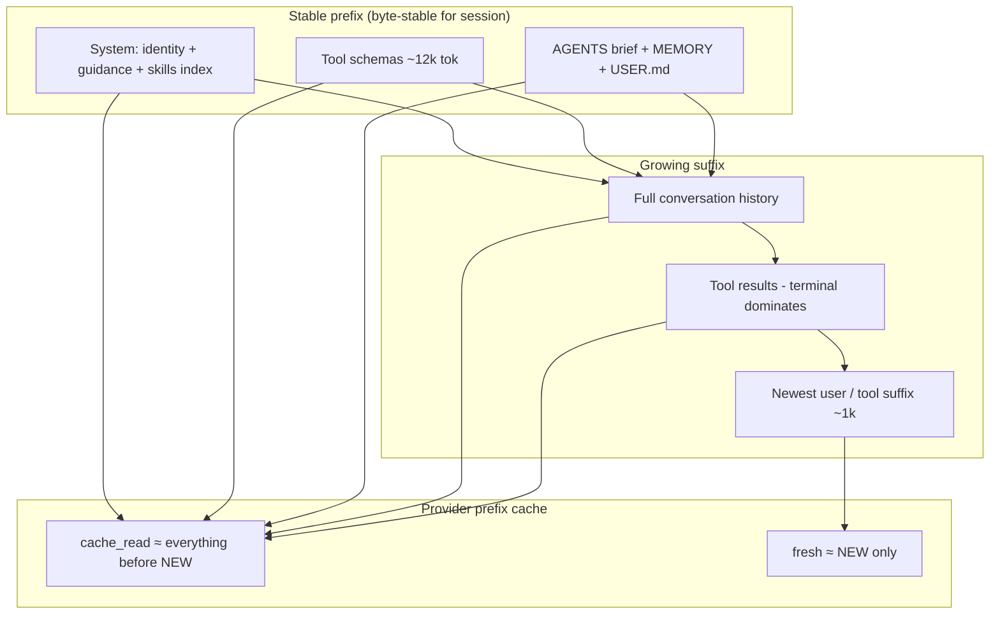

# Hermes Context & Prompt Cache Architecture Audit

**Date:** 2026-07-20  
**Scope:** Investigation only — no runtime, prompt, memory, compression, or cache behaviour changes.  
**Follow-on architecture (no implementation):** [`HERMES_CONTEXT_ENGINEERING_V2_ARCHITECTURE.md`](./HERMES_CONTEXT_ENGINEERING_V2_ARCHITECTURE.md) — Working Memory + SAFE archive / MUTATING pin layers; do not chase `cache_read`.  
**Primary evidence sources:**

| Source | Role |
|--------|------|
| Code paths (`agent/system_prompt.py`, `turn_context.py`, `conversation_loop.py`, `prompt_caching.py`, `delegate_tool.py`) | Architecture of record |
| Live `hermes prompt-size --json` (CLI / minimax-m3) | Current fixed-floor sizes |
| `~/.hermes/state.db` sessions (esp. `20260619_092959_3be2c9`) | Real production usage |
| Prior audits (`HERMES_CONTEXT_POLICY_P0_RCA.md`, `HERMES_WAKEUP_ANALYSIS.md`, `HERMES_TOKEN_OPTIMIZATION_INVESTIGATION_COMPLETE.md`, `HERMES_DELEGATION_ROI.md`) | Historical measurements |
| `~/.hermes/config.yaml` | Active thresholds |

---

## Executive answers (the five questions)

### 1. Why are ~650k cached tokens sent repeatedly?

**Because Hermes is a single agent+tool loop that resends the full growing transcript on every API call, and the provider is successfully prefix-caching almost all of it.**

Typical mid-loop signature:

| Field | Example (user report) | Meaning |
|-------|----------------------|---------|
| Fresh input | ~1,070 | New suffix only (latest tool result ± small assistant stub) |
| Cache read | ~656,093 | Stable prefix + prior history served from provider KV/prefix cache |
| Total input | ~657,163 | Full prompt still occupies the model context window |

This is **not** a separate planner/executor/verifier each inheriting a copy of the world. There is one conversation; each tool iteration is another LLM call with the same system prompt, the same tool schemas, and the entire history to date.

On the current config (`model.context_length: 1_000_000`, `compression.threshold: 0.9`, `context_governor.enabled: false`), compaction does not fire until ~900k prompt tokens — so a long engineering session can sit in the **500–700k** band for many consecutive calls while still reporting >94% cache hit.

### 2. Which components consume the most prompt space?

**Order of magnitude on a long engineering session (dominant → small):**

1. **Conversation history + tool results** (grows unboundedly; primary driver past ~50k)  
2. **Assistant reasoning / tool-call payloads** (large on MiniMax-class models)  
3. **Tool schemas** (~12k tok fixed, resent every call)  
4. **System prompt** (~8k tok today; historically larger — one session stored a 91k-char system prompt)  
5. **Skills index** (~3–4k tok inside system)  
6. **Project context / memory / USER.md** (small after Phase-1 AGENTS.md brief)

### 3. What is needed vs unnecessarily replayed?

| Context | Needed for final engineering judgment? | Needed on every incremental shell/read call? |
|---------|----------------------------------------|-----------------------------------------------|
| System identity + tool guidance | Yes | Yes (cheap once cached) |
| Full tool schemas | Yes for tool-calling turns | Yes today (always attached) |
| Entire terminal/log history | Rarely | **No** — usually last N results + decisions |
| Full parent transcript inside subagents | No | Already isolated (good) |
| Skills catalog | Sometimes | Index is useful; full skill bodies are on-demand |
| MEMORY.md / USER.md | Session-level | Low churn; fine in system prefix |

### 4. How much can be eliminated without reducing model performance?

| Lever | Est. reduction in *billable/context* volume | Reasoning-quality risk |
|-------|---------------------------------------------|------------------------|
| Tool-trace pruning (already designed; governor currently off) | 20–40% of peak live tokens | Low if decisions preserved |
| Parallel tool batching (wake-up analysis) | ~3% of API calls | None |
| Leaner early-inspect context / task packets | 30–70% on inspect-only steps | Medium if over-applied to mutate steps |
| Subagent isolation (already present) | Already saves parent history | None |
| Shrinking fixed floor further | <5% at 650k scale | Low–medium |

**Important:** Cutting *cache_read* numbers without cutting *what must be attended* does not save much if the provider discounts cache heavily — and can hurt continuity (see P0 RCA). Optimise for **cost per successful task** and **working-memory fidelity**, not cache vanity metrics.

### 5. Highest-ROI architecture?

**Greatest reduction with least reasoning damage:** keep Hermes’ cache-stable prefix + single orchestrator, but stop treating every tool step as requiring the full raw transcript.

Preferred stack (recommendation only — not implemented):

1. **Orientation map / scratchpad** (decisions, files, TODOs, open questions) — compact, always in context  
2. **Tool-trace TTL / staged prune** — collapse old SAFE/LOOKUP dumps while protecting mutate+verify tails  
3. **Execution packets for leaf work** — already approximated by `delegate_task`; extend for local inspect bursts  
4. **Checkpoint / compact only near hard window** — current 90% threshold is continuity-friendly; do not reintroduce absolute 28k governor for interactive MiniMax

---

## Configuration snapshot (this machine)

```yaml
model:
  provider: opencode-go
  default: minimax-m3
  context_length: 1000000
compression:
  enabled: true
  threshold: 0.9          # → ~900k tokens before compress
  protect_last_n: 30
context_governor:
  enabled: false          # absolute 28k path OFF
prompt_caching:
  cache_ttl: 5m
```

Implication: **large cache_read totals are expected and currently preferred over early compaction** (product decision documented in `HERMES_CONTEXT_POLICY_P0_RCA.md`).

---

## Phase 1 — Prompt composition

### Architecture correction: there is no Planner / Executor / Verifier agent

Hermes does **not** run a multi-agent planner→executor→verifier pipeline for normal engineering tasks. The loop is:

```
User turn
  → build_turn_context()          # once per turn
  → while tool loop:              # 1 LLM call per iteration
        assemble api_messages
        LLM call
        if tool_calls → execute → append → continue
        else → final response
```

What people call “planner / executor / reflection / verification” are **roles the same model plays across iterations**, not separate prompt pipelines.

| Colloquial role | Actual Hermes call | Typical purpose |
|-----------------|--------------------|-----------------|
| Planner | Early assistant turns in the loop | Decide next tools / approach |
| Executor | Assistant turns that emit mutating tools | patch / write / terminal mutate |
| Tool | Not an LLM call | Runtime tool execution |
| Reflection | Mid-loop assistant turns after tool results | Interpret output, replan |
| Verification | Late turns (tests, git status, read-back) | Confirm mutations |
| Final response | Last assistant turn without tool_calls | User-visible answer |

Optional MoA / `delegate_task` children are separate loops; they are **not** the default path for every tool step.

### Fixed floor (live, 2026-07-20)

`hermes prompt-size --json` (platform=cli, model=minimax-m3):

| Component | Bytes | ~Tokens (÷4) | % of fixed floor (~82kB) |
|-----------|------:|-------------:|-------------------------:|
| System prompt total | 33,580 | ~8,400 | 41% |
| └ stable (identity / guidance / skills) | 25,974 | ~6,500 | 32% |
| └ context (AGENTS.md brief) | 3,671 | ~920 | 4% |
| └ volatile (memory / USER.md / date) | 3,931 | ~980 | 5% |
| Skills index (inside stable) | 13,352 | ~3,300 | 16% |
| Memory block | 2,409 | ~600 | 3% |
| User profile | 1,457 | ~360 | 2% |
| Tool schemas (30 tools) | 48,405 | ~12,100 | 59% |
| **Fixed floor (sys+tools)** | **~82kB** | **~20.5k** | **100%** |

At a 650k total prompt, the fixed floor is only **~3%**. History dominates.

### Per-call payload (every LLM iteration)

| Section | Absolute (cold / early) | Absolute (late, ~650k total) | % late | Rebuilt each call? |
|---------|------------------------:|-----------------------------:|-------:|--------------------|
| System prompt | ~8k | ~8k | ~1% | No — session-cached string |
| Tool schemas | ~12k | ~12k | ~2% | Same object each call |
| Memory / USER.md | ≤1k | ≤1k | <1% | Frozen in system string |
| Project context | ~1k | ~1k | <1% | Frozen (first-wins file) |
| Conversation history | grows | **~600k+** | **~90%+** | Full replay |
| Latest tool output | n/a | ~1k | ~0.2% | New suffix |
| Prefetch / plugin sidecars | variable | variable | small | On user msg `api_content` only |

Developer/system split: Hermes uses a single `role:system` string (no separate OpenAI “developer” channel in the default path).

### Production session composition (largest local session)

Session `20260619_092959_3be2c9` (“Hermes Recovery and Revenue Launch”):

| Metric | Value |
|--------|------:|
| API calls | 261 |
| Messages (active) | 603 |
| Tool calls | 343 |
| User turns | 13 |
| Cache read total | 55,783,831 |
| Fresh input total | 3,578,323 |
| Cache hit rate | **94.0%** |
| Avg cache_read / call | ~213,731 |
| Avg fresh input / call | ~13,710 |
| Stored system_prompt chars | 91,073 |

Active message mass by role:

| Role | Count | Chars | Share of transcript chars |
|------|------:|------:|--------------------------:|
| assistant | 247 | 718,021 | 51% |
| tool | 343 | 549,179 | 39% |
| user | 13 | 130,692 | 9% |

---

## Phase 2 — Prompt diff (consecutive LLM calls)

### What changes between call *N* and call *N+1* inside one user turn

```
Call N                    Call N+1
─────────────────────     ─────────────────────
[system]  IDENTICAL  →    [system]  IDENTICAL
[tools]   IDENTICAL  →    [tools]   IDENTICAL
[msg 0..k] IDENTICAL →    [msg 0..k] IDENTICAL
                          + assistant (tool_calls)
                          + tool result(s)          ← ONLY NEW BYTES
```

**Typical mid-loop prompt diff:**

| Section | Status |
|---------|--------|
| System prompt | Identical |
| Tool schemas | Identical |
| Prefill / ephemeral system (if any) | Identical within child |
| Historical user/assistant/tool messages | Identical (incl. `api_content` sidecars) |
| Newest assistant tool_calls message | **Added** |
| Newest tool result(s) | **Added** |
| Memory injection | Identical (frozen in system; prefetch replayed via sidecar) |

**Empirical pattern matching the user’s example:**

> Call *k*: ~95–99% of tokens identical to call *k−1*; only the latest shell/tool output (~1k) is fresh; provider reports the remainder as `cache_read`.

### What changes between user turns

| Event | Diff |
|-------|------|
| New user message | Added at end |
| Memory prefetch / plugin context | Appended to **API copy** of that user message (`api_content`), then replayed verbatim later |
| Compression | History middle rewritten; system may invalidate/rebuild → large cache miss |
| Slash commands that mutate skills/tools | Deferred by design (`--now` opt-in) to protect cache |

Hermes intentionally does **not** rebuild the system prompt every turn. That is correct cache-first design.

---

## Phase 3 — Duplicate detection

| Component | Duplicate? | Approx size | Source / notes |
|-----------|------------|------------:|----------------|
| System prompt resent every call | Intentional replay (cached) | ~8–23k tok | `conversation_loop` prepend |
| Tool schemas resent every call | Intentional replay | ~12k tok | `build_api_kwargs` |
| Tool results in history | Intentional replay | grows | Required for ReAct loop |
| AGENTS.md + SOUL.md | Partial overlap possible | small | SOUL is identity; AGENTS is project; first-wins among project files |
| Skills index vs skill bodies | Not duplicate | index ~3k | Bodies loaded via `skill_view` / slash, not double-injected |
| MEMORY.md in system + memory tool results | Soft duplicate | small | Snapshot in system; tool mutates store; system frozen until compress |
| External memory prefetch + MEMORY.md | Possible thematic overlap | capped | Prefetch on user sidecar, not system |
| Parent history inside subagent | **No** | 0 | `skip_context_files` + `skip_memory` + fresh conversation |
| Delegation summary then re-explained in parent | Mild | ~6k avg result | Parent keeps `delegate_task` result in transcript |
| Async delegation completion user messages | Inflates user side | up to ~45k chars observed | Injected as user turns with full task source |
| Policies / guidance blocks | Some thematic overlap | medium | Task-completion + tool-use + parallel-tool guidance are distinct strings |
| Transcript in multiple formats | Not observed as dual wire formats | — | Single OpenAI-style message list |

**Verdict:** There is little *accidental* double-injection of the same document. The dominant “duplication” is **temporal replay** of tool traces across hundreds of API calls — by design of the agent loop.

---

## Phase 4 — Context growth

### Growth curve (session `20260619_092959_3be2c9`)

Approximate cumulative transcript size (chars÷4 as lower-bound tokens; provider tokens run higher):

```
API / msg progress     Cum transcript ~tok
──────────────────     ───────────────────
msg 21                 ~15k
msg 101                ~49k
msg 201                ~119k
msg 301                ~165k
msg 401                ~206k
msg 501                ~253k
msg 603 (end)          ~350k chars/4  (~480k at chars/3.2)
```

Provider-reported averages for the same session (~214k cache_read/call) sit between mid and late growth — consistent with a long-lived prefix cache over a growing window.

### Category growth rates

| Category | Growth behaviour | Fastest? |
|----------|------------------|----------|
| Conversation / tool outputs | Linear–superlinear with tool loop depth | **Yes** |
| Assistant reasoning text | Tracks tool iterations | Yes (secondary) |
| Memory | Flat within session | No |
| Repository (AGENTS.md) | Flat (brief) | No |
| Tool schemas | Flat | No |
| Logs (terminal) | Dominant subset of tool outputs | **Yes (within tools)** |



**Fastest growing category:** terminal tool results (272 calls, 392k chars in the reference session), then assistant reasoning text, then patch/delegate payloads.

---

## Phase 5 — Internal agent isolation

### Classification of call types

| Call type | Needs full context? | Minimum sufficient context | Est. savings if minimized |
|-----------|---------------------|----------------------------|---------------------------|
| Opening plan after user ask | Recent history + orientation map + repo pointers | Task packet + map | 0–20% (already near full) |
| SAFE inspect (read/search/status) | **Recent history only** | Last N tool results + map + schemas | **40–70%** of that call’s tokens |
| Mutating execute | Decisions + relevant files + recent errors | Task packet + file slices + map | 20–40% |
| Verify (tests/diff) | Mutation intent + test output | Packet + last mutate + test log | 30–50% |
| Final user response | Summary of work + open questions | Orientation map + last verify | 50–80% |
| `delegate_task` child | Goal + explicit context string | Already isolated | Already optimal for parent |
| Compression / aux LLM | Dedicated summary prompt | Already separate | n/a |

### Current isolation reality

| Path | Isolation today |
|------|-----------------|
| Main CLI/gateway agent | **Full transcript every call** |
| Subagent (`delegate_task`) | Fresh conversation; no parent history; no AGENTS.md; no MEMORY.md |
| Cron | Often `skip_memory=True`; own session |
| MoA reference models | Separate calls (opt-in) |

**Estimated savings if inspect-only steps used task packets (rough):**

- Reference session: 140 inspect turns / 234 tool turns (`HERMES_INSPECTION_POLICY.json`)  
- If those inspect turns ran at ~30% of full context:  
  - **Order-of-magnitude:** 25–45% fewer total input+cache tokens for that session  
  - Reasoning risk: **medium** unless the orientation map carries decisions/files

Subagent isolation already helps the parent: children were **56.8% of family API** but only **16.5% of family cache** (`HERMES_DELEGATION_ROI.md`) — workers are cheaper on cache because they start small.

---

## Phase 6 — Tool output analysis

### Reference session tool-result stats

| Tool | Count | Total chars | Avg chars | Max chars | Typical subsequent replays |
|------|------:|-----------:|----------:|----------:|---------------------------:|
| `terminal` | 272 | 391,770 | 1,440 | 18,597 | up to ~240 later API calls |
| `patch` | 16 | 58,563 | 3,660 | 9,289 | high (mid-session) |
| `delegate_task` | 9 | 54,702 | 6,078 | 12,129 | high |
| `todo` | 24 | 21,176 | 882 | 2,087 | medium |
| `read_file` | 11 | 19,039 | 1,731 | 4,889 | very high if early |
| `write_file` | 11 | 3,929 | 357 | 419 | medium |

### Cumulative replay cost (char × later API calls)

| Tool result (example) | Size | Replayed on | Cumulative chars resent |
|-----------------------|-----:|------------:|------------------------:|
| Early large `terminal` | 18,597 | 241 | **4.48M** |
| Early `terminal` | 9,519 | 246 | 2.34M |
| `delegate_task` | 11,623 | 186 | 2.16M |
| Early `read_file` | 4,889 | 244 | 1.19M |

**Total tool-result char×replay for the session:** ~73M chars (~18M tok at ÷4) — this is why cache_read aggregates into the tens of millions even when “fresh” input looks small.

### Contributor ranking (engineering tasks)

| Contributor | Avg size | Max size | Replay pressure |
|-------------|----------|----------|-----------------|
| Shell / terminal logs | High | Highest | **Highest** |
| Git diff / patch echoes | Medium–high | High | High |
| Delegate summaries | High | High | High |
| File reads | Medium | Medium | High if early |
| Search results | Medium | Medium | Medium |
| Tests output | Medium–high | High | High |
| Browser / web fetch | Variable | High | Medium |
| JSON tool envelopes | Low–medium | Medium | Medium |
| Markdown policies in system | Fixed | Fixed | Cached (good) |

---

## Phase 7 — Cache behaviour

### Observed hit rates (local DB)

| Scope | Cache hit |
|-------|-----------|
| Largest session | 94.0% |
| Several mid-size sessions | 92–97% |
| Aggregate (22 sessions with cache) | ~93.7% of (input+cache_read) |

`cache_write_tokens` is **0** across these MiniMax / OpenCode Go rows — consistent with **automatic / passive prefix caching** (usage surfaces as `cache_read`, not Anthropic-style cache write accounting).

### Capability layer

| Mode | Meaning | When used |
|------|---------|-----------|
| `NONE` | No cache assumption | Rare / unknown transports |
| `AUTO` | Provider caches prefixes; Hermes emits **no** markers | Many OpenAI-wire models |
| `EXPLICIT` | Emit `cache_control` (`system_and_3`) | Anthropic wire / MiniMax anthropic / some aggregators |

OpenCode Go + MiniMax: capability resolves via `plugins/model-providers/opencode-zen` — Anthropic Messages → EXPLICIT native; other wires → AUTO/envelope rules.

### Strategy `system_and_3` (`agent/prompt_caching.py`)

Up to **4** breakpoints: system + last 3 markable non-system messages, TTL `5m` or `1h`.

### What invalidates / misses cache

| Change | Invalidates prefix? |
|--------|---------------------|
| Append tool result / assistant turn at end | **No** for prior prefix (hit); suffix misses |
| Byte-stable system replay | No |
| Compression rewriting middle history | **Yes** from rewrite point |
| System prompt rebuild after compress | **Yes** for system prefix |
| Mid-session toolset swap | **Yes** (forbidden by project doctrine) |
| Timestamp inside system every turn | Would yes — Hermes uses **date-only** session stamp in volatile tier, frozen for session |
| Prefetch injected into system | Would yes — Hermes puts prefetch on **user** `api_content` instead |
| Marker recompute on deep copy | No (markers applied to API copy only) |

### Cache-first design checklist (Anthropic / Microsoft Cache Explorer principles)

| Principle | Hermes today |
|-----------|--------------|
| Stable prefix first | **Yes** — system + tools + history order |
| Volatile content last | **Yes** — new user/tool at end; prefetch on user sidecar |
| Don’t mutate tools mid-session | **Yes** (doctrine + code) |
| Don’t put clocks in prefix every call | **Mostly yes** (date frozen in session prompt) |
| Isolate exploration in subagents | **Yes** (`delegate_task`) |
| Compact/fork carefully | Compression is intentional break; threshold currently late (0.9) |

**Verdict:** Cache architecture is healthy. High `cache_read` is evidence of success, not failure. The cost problem (if any) is **how large the attended window becomes**, not “cache is broken.”

---

## Phase 8 — Call graph

### Typical engineering turn (single agent)



### Annotated node costs (illustrative mid/late session)

| Node | Prompt size | Cache read | Fresh | Output |
|------|------------:|-----------:|------:|-------:|
| User turn prologue | (no LLM) | — | — | — |
| LLM #1 (plan) | ~40–80k early / up to ~650k late | ~90–99% | user msg | plan + tool_calls |
| Tool: search/read | (no LLM) | — | — | result ~1–5k |
| LLM #2 | prior + result | ~95%+ | ~1–5k | next tools |
| Tool: terminal | (no LLM) | — | — | result ~1–18k |
| LLM #k | growing | ~95%+ | ~1k | … |
| Optional `delegate_task` | **child:** small fresh | child cache grows separately | goal+context | summary to parent |
| Final LLM | full | high | small | answer |

### Real fan-out example (reference session)

```
User (13 turns)
  └─ Parent loop ≈ 261 API / 343 tools
       ├─ terminal ×272
       ├─ patch ×16
       ├─ read/write_file ×22
       ├─ todo ×24
       └─ delegate_task ×9 ──► child loops (fresh context each)
```

Wake-up analysis on 20 sessions: **549 API / 742 tools** → 1.35 tools per API call; batching SAFE/LOOKUP would save only ~3% of calls.

---

## Phase 9 — Compare against current best practice

| Pattern | Modern practice | Hermes | Gap |
|---------|-----------------|--------|-----|
| Cache-stable prefix | Static system/tools first | Strong | None material |
| Context engineering vs bigger windows | Select context per call | Uses big window + late compact | **Main gap** |
| Orientation / context maps (PEEK-like) | Compact always-on map | Implicit in transcript + todos | **Missing first-class map** |
| Subagent isolation | Research in children | `delegate_task` solid | Under-used for inspect bursts |
| Task / execution packets | Leaf gets only packet | Children get goal+context; main loop does not | **Main-loop gap** |
| Checkpointing | Persist decisions outside transcript | Session DB + todos; no structured scratchpad | Partial |
| Retrieval over replay | Pull files when needed | `read_file` / search exist; still keep old dumps | Tool dumps linger |
| Tool-trace compaction | Collapse old LOOKUP | Governor stages exist; **governor disabled** locally | Config gap |
| Copilot-style /continue cache | Stable thread, volatile at end | Same idea | Aligned |
| LangGraph style state | Explicit state object | Messages-as-state | Different paradigm |

Hermes is **ahead** on prompt-cache discipline and subagent isolation, and **behind** on per-call context selection for the main loop. Prior token-optimisation work correctly concluded the cache layer itself is not the bug; this audit agrees — and locates remaining ROI in **transcript engineering**, not marker tweaks.

---

## Phase 10 — Recommendations (do not implement yet)

Ranked by ROI for *this* deployment (MiniMax M3 / 1M / compression 0.9 / governor off).

| Rank | Recommendation | Est. token reduction | Est. cost reduction | Effort | Risk | Reasoning impact |
|------|----------------|---------------------:|--------------------:|--------|------|------------------|
| 1 | **Re-enable staged tool-trace pruning only** (governor optimisation stage; not absolute 28k) | 20–40% peak live | 15–35% if cache discounted; less if flat billed | S | Low | Low if decisions preserved |
| 2 | **First-class orientation map / scratchpad** (decisions, files, TODOs, blockers) outside raw logs | Enables #3–4; direct 5–10% | 5–15% | M | Low | **Positive** (continuity) |
| 3 | **Inspect-step task packets** (lean context for SAFE/LOOKUP bursts; full context for mutate/verify) | 25–45% session | 20–40% | L | Medium | Neutral if map is good; negative if naive |
| 4 | **Terminal/log TTL** (collapse outputs older than N tool steps to hash+summary) | 15–30% | 10–25% | M | Low–med | Low |
| 5 | **More deliberate `delegate_task` for exploration** | Parent cache growth ↓ | 10–20% parent | S (policy/skill) | Low | Neutral–positive |
| 6 | **Parallel tool-call steering** (already in prompt; measure adherence) | ~3% calls | ~3% | S | Very low | None |
| 7 | Further shrink skills index / fixed floor | <5% at 650k scale | <5% | S | Low | Low |
| 8 | Aggressive mid-session compression to chase lower cache_read | Looks great on charts | May ↑ real cost via misses + **hurts continuity** | S | **High** | **Negative** (P0 RCA) |
| 9 | Split planner/executor/verifier agents each with full context | Can *increase* tokens | Negative | L | High | Unclear |

### Worked examples

**A. Subagent isolation for inspection (policy, not new infra)**  
- Expected reduction: 10–20% parent tokens on exploration-heavy tasks  
- Risk: Very low  
- Reasoning impact: None to positive (cleaner parent)

**B. Orientation map + tool-trace TTL**  
- Expected reduction: 30–50% of peak attended tokens on day-long sessions  
- Risk: Low–medium  
- Reasoning impact: Neutral to positive

**C. Reintroducing absolute 28k live budget**  
- Expected reduction: large on paper  
- Risk: **Very high** (already proven continuity failure)  
- Reasoning impact: **Severe** — rejected for interactive MiniMax

---

## Instrumentation notes (measurement-only posture)

Existing hooks sufficient for ongoing audits (no new runtime behaviour required):

| Signal | Where |
|--------|-------|
| `cache_read_tokens` / `input_tokens` / `api_call_count` | `sessions`, `session_model_usage` |
| Fixed floor breakdown | `hermes prompt-size --json` |
| Tool/inspect taxonomy | `audit/HERMES_INSPECTION_POLICY.json`, wakeup/delegation analytics |
| Observational prompt pie | `agent/intelligence_policy.py` PolicyRunObserver (when enabled) |

**Gap:** no always-on per-section pie chart on every API call. For a future measurement pass, a **shadow logger** (write sizes to audit JSON, do not alter prompts) would close Phase-1 absolute/percentage gaps at provider-token fidelity. Out of scope for this investigation.

---

## Relation to prior “token optimisation closed” verdict

`HERMES_TOKEN_OPTIMIZATION_INVESTIGATION_COMPLETE.md` concluded: cache isn’t broken; exploration strategy dominates; freeze runtime.

This audit **agrees** on cache health and **reframes** the remaining question:

> High cache_read at ~650k is the healthy signature of a long, cache-stable ReAct loop on a 1M model with late compaction.  
> The open design choice is whether the main loop should keep **attending** to hundreds of kilotokens of old terminal dumps on every inspect step — not whether prefix caching works.

---

## Appendix A — Key code references

| Concern | Location |
|---------|----------|
| Three-tier system prompt | `agent/system_prompt.py` |
| Skills / AGENTS.md builders | `agent/prompt_builder.py` |
| Per-turn prologue + user sidecars | `agent/turn_context.py` |
| Full-history API assembly + cache markers | `agent/conversation_loop.py` |
| `system_and_3` markers | `agent/prompt_caching.py` |
| Capability resolution | `agent/prompt_cache_capabilities.py` |
| Subagent isolation | `tools/delegate_tool.py` |
| Compression + system invalidate | `agent/conversation_compression.py` |
| Usage normalization | `agent/usage_pricing.py` |

## Appendix B — Evidence session IDs

| Session | Why it matters |
|---------|----------------|
| `20260619_092959_3be2c9` | Largest cache volume; 261 API; 94% hit; tool replay study |
| `20260619_095922_535c41` et al. | Confirm 92–97% hit rates on shorter tasks |
| Prior JSON | `audit/HERMES_INSPECTION_POLICY.json`, wakeup/delegation audits |

---

## Appendix C — One-page architecture diagram



---

*End of audit. No behaviour changes were made.*
