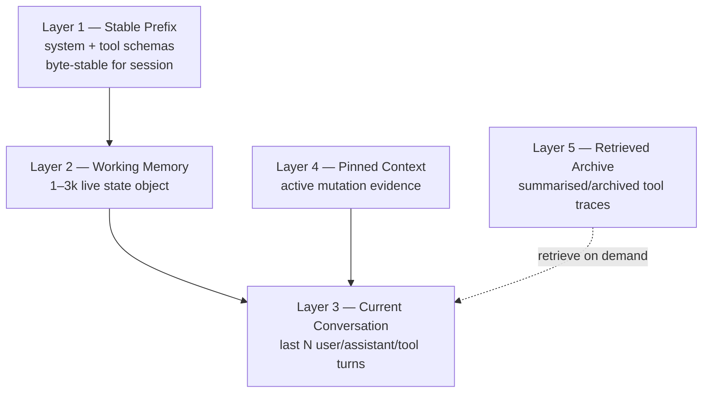
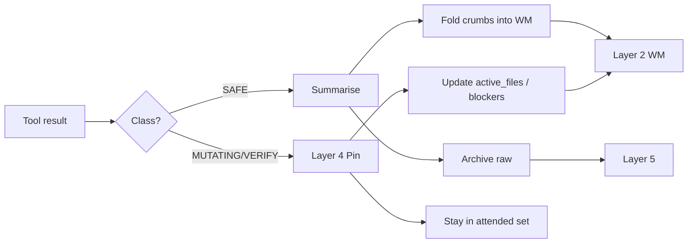

# Hermes Context Engineering V2 — Architecture

**Status:** Approved (2026-07-20) — P6 retrieve + A/B soak shipped  
**Date:** 2026-07-20  
**Depends on:** [`CONTEXT_ARCHITECTURE_AUDIT.md`](./CONTEXT_ARCHITECTURE_AUDIT.md)  
**Related:** [`HERMES_CONTEXT_POLICY_P0_RCA.md`](./HERMES_CONTEXT_POLICY_P0_RCA.md), [`HERMES_TOKEN_OPTIMIZATION_INVESTIGATION_COMPLETE.md`](./HERMES_TOKEN_OPTIMIZATION_INVESTIGATION_COMPLETE.md)

| Phase | Status |
|-------|--------|
| P0 Architecture | **Approved** |
| P1 Shadow prompt profiler | **Shipped (opt-in, log-only)** — see §14 |
| P2 WM store + dark assemble stub | **Shipped (opt-in, dark)** — see §15 |
| P3 SAFE summarise→archive shadow | **Shipped (opt-in, shadow)** — see §16 |
| P4 MUTATING pin/unpin epoch | **Shipped (opt-in, dark)** — see §17 |
| P5 Layered assemble (inspect) | **Shipped (opt-in wire change)** — see §18 |
| P6 Retrieval helper + A/B soak | **Shipped (opt-in)** — see §19 |
| P7 Default-on | Not started |

---

## 0. Premise (why this document exists)

The context audit established:

1. Prompt caching is healthy (~94% hit). Do **not** chase lower `cache_read`.
2. Hermes is a single ReAct loop that resends a growing transcript. That is by design.
3. The real cost is **attended context**: old SAFE terminal dumps replayed across 200+ later API calls.
4. Fixed floor (system, skills, tool schemas), cache markers, compression threshold (0.9), and subagent isolation are already correct — leave them alone.
5. Continuity beats token vanity on MiniMax-class windows (P0 RCA). Absolute 28k live budgets are rejected for interactive work.

**Therefore V2 is not “prompt optimisation.”**  
It is a **context operating system**: select and structure what the model must attend to on each call, while keeping everything else available on demand.

---

## 1. North star

> Reduce **attended tokens per step** without reducing **access to evidence** or **engineering continuity**.

Success is measured as **cost per successful engineering task**, not cache-read vanity.

Target shape for a late mid-session call (illustrative):

| Layer | Budget |
|-------|-------:|
| Stable prefix (system + tools) | ~20k |
| Working Memory | 1–3k |
| Recent conversation (last N) | ~10–25k |
| Pinned context (active mutations) | ~10–40k |
| Retrieved archive (on demand) | 0 unless fetched |
| **Typical attended total** | **~50–90k** instead of **~650k** |

The agent still *owns* the full history. It is no longer *forced to read* all of it every inspect step.

---

## 2. Five-layer context model



### Layer 1 — Stable Prefix (unchanged)

**Contents:** identity, guidance, skills index, MEMORY/USER snapshots, AGENTS brief, tool schemas.

**Rules:**

- Built once per session; byte-stable (existing invariant).
- Volatile per-turn injections stay off this layer (existing `api_content` / user-sidecar pattern).
- **Out of scope for V2 changes.** Do not shrink for ROI theatre.

### Layer 2 — Working Memory (new — the missing layer)

**Not:** long-term memory (`MEMORY.md` / providers).  
**Not:** the transcript.  
**Not:** a compression summary of the whole chat.

**Is:** a live, structured **engineering state object** for the current objective. Always small. Always present on model-facing calls that need orientation.

Example schema (conceptual — not a wire format commitment):

```yaml
working_memory:
  objective: "Fix tax report generation for July"
  hypothesis: "Terminal logs dominate context growth; cache is fine"
  decisions:
    - "Governor stays disabled for interactive MiniMax"
    - "Compression stays at 0.9"
    - "Prefer context engineering over cache-read chasing"
  active_files:
    - path: agent/turn_context.py
      intent: "wire WM injection point"
    - path: agent/conversation_loop.py
      intent: "assemble layered api_messages"
  blockers:
    - "Need shadow prompt profiler before enabling prune"
  branch: "feature/context-engineering"
  open_questions:
    - "Should inspect packets omit transcript entirely?"
  mutation_epoch: 3          # increments on each mutate→verify cycle
  last_updated_api_call: 184
```

**Hard budget:** 1–3k tokens. If over budget, drop lowest-priority fields first (open_questions → verbose hypothesis → oldest decision notes), never drop `objective` or `active_files` while a mutation is open.

**Lifecycle:**

| Event | Working Memory update |
|-------|------------------------|
| New user objective | Reset or fork objective; clear stale hypothesis/blockers |
| SAFE inspect finding | Fold into hypothesis / brief findings; do **not** paste raw logs |
| Decision made (user or agent) | Append to `decisions` |
| Mutate starts | Add/refresh `active_files`; bump `mutation_epoch` |
| Verify passes | Clear files for that epoch; note outcome in decisions |
| Topic change / `/new` | New WM object (archive prior WM into Layer 5) |

**Critical property:** Working Memory is the thing inspect steps read **instead of** reconstructing state from 600k of conversation.

### Layer 3 — Current Conversation

**Contents:** last *N* interactions (user / assistant / tool), role-aware.

**Intent:** local dialogue continuity and immediate tool I/O — not the whole session autobiography.

**Suggested default (interactive):** protect roughly the last 8–16 **non-bulky** turns, or a token budget (~10–25k), preferring user+assistant over raw tool bodies.

This layer replaces “the entire active transcript is always in the prompt.”

### Layer 4 — Pinned Context

**Contents:** evidence that must remain verbatim while a mutation is in flight:

- git diffs / patch outputs
- failing tests
- compiler / type errors
- the mutating command + its direct result
- verification commands for the open epoch

**Rules:**

- Enter pin on MUTATING tool class (see §4).
- Stay pinned across inspect/verify steps for that `mutation_epoch`.
- Unpin only after verification succeeds **or** the user explicitly abandons/cancels the mutation.
- Pins are **not** TTL’d by age.

Layer 4 is how V2 preserves engineering quality while Layer 5 deletes bulk SAFE noise.

### Layer 5 — Retrieved Archive

**Contents:** summarised + archived tool traces, old plans, old reasoning blobs, superseded inspect dumps.

**Default:** not in the prompt.  
**Access:** retrieve by id/ref when Working Memory or the model decides raw evidence is needed again.

Archive entry (conceptual):

```yaml
archive_id: tr_0x9f3a
kind: terminal
class: SAFE
created_api_call: 12
summary: |
  Workspace inspected.
  Key findings:
  - 14 files at repo root
  - package.json present
  - src/ exists
raw_ref: session_blobs/tr_0x9f3a.txt   # or DB blob
tokens_raw: 1480
tokens_summary: 48
```

Retrieval is an explicit act (tool or runtime inject), not ambient replay.

---

## 3. How Working Memory fits the existing Hermes architecture

V2 must compose with invariants that already work.

### 3.1 Placement relative to today’s modules

| Existing piece | V2 relationship |
|----------------|-----------------|
| `_cached_system_prompt` / three tiers | Remains Layer 1. WM is **not** merged into system (would either bloat the stable prefix or break byte-stability if updated). |
| `turn_context.compose_user_api_content` | Natural **injection seam** for WM on API copies (sidecar / structured block), analogous to memory prefetch — stored conversation stays clean. |
| `conversation_loop` api_messages assembly | Becomes the **layer assembler**: L1 + L2 + L3 + L4 (+ optional L5 retrieve). |
| `todo` tool | Orthogonal checklist UX. May *feed* WM, must not *replace* WM. |
| Built-in / provider memory | Long-term durable facts. WM is ephemeral per objective/session epoch. |
| Context compressor / SUMMARY_PREFIX | Emergency / late-window path still exists at 0.9. WM should make middle-of-session compress **rarer**, and handoff should seed WM from summary if compress does fire. |
| Context governor | V2’s SAFE archive path is the principled replacement for “absolute live budget.” Governor absolute 28k stays off for interactive. |
| `delegate_task` | Children already skip parent history. Optionally receive a **WM snapshot + packet**, not the parent transcript. |
| Prompt cache markers / capabilities | Unchanged. Assembler must keep L1 stable; put WM/L3/L4 after the stable prefix so updates don’t invalidate system/tools cache. |

### 3.2 Cache-safe injection rule

```
[ Layer 1: system ]     ← never mutate mid-session
[ Layer 1: tools ]      ← never mutate mid-session
[ Layer 2: WM ]         ← may update every few calls (expected small miss after WM)
[ Layer 3: recent ]     ← grows/slides at the end
[ Layer 4: pins ]       ← appended/updated near the end
[ Layer 5: retrieves ]  ← only when fetched, at the end
```

Updating Working Memory will cause a **local** prefix miss from the WM boundary onward. That is acceptable: WM is 1–3k, and the alternative is attending 600k. Do **not** put WM inside Layer 1 to “save” that miss.

### 3.3 Persistence

| Store | What |
|-------|------|
| Session DB (or sidecar table) | Current WM JSON; archive index; pin set; blob refs |
| Message transcript | Remains source of truth for *what happened*; may be **view-projected** for the API |
| User-visible UX (optional later) | `/wm` or sidebar — out of scope for architecture approval |

Gateway rebuilds a fresh `AIAgent` per turn today: WM must restore from session DB the same way `_cached_system_prompt` does.

### 3.4 What Working Memory is *not*

| Anti-pattern | Why rejected |
|--------------|--------------|
| Dumping WM into SOUL/MEMORY.md | Pollutes long-term memory; wrong lifetime |
| Replacing the transcript entirely | Breaks auditability and user trust |
| Auto-writing every tool stdout into WM | WM would become another dump |
| Per-call LLM rewrite of WM from full history | Defeats the purpose; use deterministic fold + sparse LLM assist |

---

## 4. Tool Trace policy: SAFE archive vs MUTATING pin (not TTL)

Simple time/age TTL is insufficient. V2 uses **evidence class + mutation epoch**.

### 4.1 Classification

| Class | Examples | Default fate |
|-------|----------|--------------|
| **SAFE** | `ls`, `rg`, read-only `git status`, `read_file`, search, browser skim | Summarise → Archive → retrieve on demand |
| **MUTATING** | `patch`, `write_file`, `git commit`, destructive shell, dependency installs | Pin until verify/abandon |
| **VERIFY** | test runners, typecheck, build, targeted git diff after mutate | Pin with the open mutation epoch; unpin with it |
| **DELEGATE** | `delegate_task` result | Summarise into WM; archive raw child log; pin only if it contains open mutate evidence |

Classification should reuse / extend the existing inspect-vs-mutate taxonomy from wakeup/inspection analytics — not invent a parallel ontology.

### 4.2 SAFE pipeline

```
SAFE tool result
    ↓
extract structured crumbs (paths found, exit code, error signature)
    ↓
update Working Memory (brief findings only)
    ↓
write archive entry: summary + raw_ref
    ↓
replace live tool message body with summary + archive_id
    ↓
raw bytes leave the attended set
```

Example transform:

```
# Before (replayed 240 times)
<18k chars of ls -la / find output>

# After (attended)
[archived:tr_0x9f3a] Workspace inspected.
Key findings:
- 14 files at repo root
- package.json found
- src/ exists
Retrieve with context_archive(id=tr_0x9f3a) if raw listing needed.
```

### 4.3 MUTATING / VERIFY pipeline

```
MUTATING tool result
    ↓
Pin verbatim into Layer 4 (bound to mutation_epoch)
    ↓
Update WM active_files / blockers
    ↓
VERIFY tools also pin to same epoch
    ↓
On verify success → Unpin epoch; fold outcome into WM decisions;
                   archive bulky verify logs if no longer needed
    ↓
On verify failure → Keep pins; update WM blockers/hypothesis
```

**Never** auto-archive a failing test or open diff while `mutation_epoch` is open.

### 4.4 Interaction with Working Memory



**Ordering invariant:**

1. Classify  
2. Update WM (structured, tiny)  
3. Pin or archive  
4. Assemble next prompt from layers  

WM is updated *from* tool policy; tool policy does not read 600k of history to decide — it uses tool metadata + current WM epoch.

### 4.5 Relation to compression

| Mechanism | When | Scope |
|-----------|------|-------|
| SAFE archive (V2) | Continuously / after SAFE bursts | Tool bodies only |
| Layer-3 slide window | Every assemble | Recent dialogue |
| Context compressor (existing) | ~90% of window | Whole middle transcript — last resort |

V2 aims to make compressor events rare again *without* reintroducing absolute 28k caps.

---

## 5. Retrieval when archived logs are needed

### 5.1 Triggers

Retrieve Layer 5 when:

- Model explicitly requests an `archive_id` (preferred)
- WM open_question / blocker references an archive id
- Verify fails and pinned evidence is insufficient (runtime may auto-retrieve the last SAFE archive touching the same path)
- User asks to “show the original output”

### 5.2 Retrieval mechanics (design constraints)

1. **Raw bytes stay out of Layer 1.** Retrieved content appends at the **end** of the API message list (cache-friendly).
2. **Budgeted inject:** e.g. max 4–8k tokens per retrieve; larger blobs require offset/segment (unlike instructional skill tools — this is dump retrieval, pagination is OK).
3. **Re-archive after use:** a retrieved SAFE dump that is not pinned expires from Layer 3 on the next slide unless re-pinned by a new mutate epoch.
4. **Subagents:** may retrieve from parent archive **only** if the parent passes `archive_id`s in the task packet — no ambient parent dump access (preserves isolation).

### 5.3 Tool surface (conceptual)

Prefer a **narrow runtime tool or internal helper**, not a new core “memory” philosophy:

- `context_archive(action=get|list, id=…)` — service-gated or always-available but tiny schema  
- Or assembler-side expansion when the model emits a structured retrieve directive  

Footprint ladder still applies: avoid a fat new core tool if a small helper + skill guidance suffices. Exact packaging is an implementation decision after this architecture is approved.

---

## 6. Who gets full context vs execution packets?

### 6.1 Step types

| Step type | Attended layers | Packet? |
|-----------|-----------------|---------|
| **Orient** (first call after new objective) | L1 + L2 + L3 (richer N) + any L4 | Optional |
| **SAFE inspect** | L1 + L2 + thin L3 + L4 if epoch open | **Yes — default** |
| **Mutate** | L1 + L2 + L3 + **full L4** + targeted retrieves | No (needs pins) |
| **Verify** | L1 + L2 + L3 + **full L4** | No |
| **Final answer** | L1 + L2 + thin L3 | Yes |
| **Subagent leaf** | Child L1′ (ephemeral) + WM snapshot + goal packet | **Yes — already close** |
| **Compress / aux** | Dedicated prompts (unchanged) | n/a |

### 6.2 Execution packet contents

```yaml
packet:
  goal: "Determine whether tax module imports broken helper"
  working_memory_ref: current   # or inline snapshot ≤3k
  pinned_ids: [pin_12, pin_13]  # if any
  recent: last_3_turns_summarised_or_verbatim
  allow_tools: [read_file, search_files, terminal_readonly, ...]
  retrieve_hints: [tr_0x9f3a]
```

Inspect packets **may omit** the long transcript. They must **not** omit Working Memory or open pins.

### 6.3 Guarantee boundary

If WM is missing/corrupt, assembler **fails open** to today’s full-transcript behaviour for that turn (see §7). Packets never silently run without orientation.

---

## 7. Guaranteeing reasoning quality never regresses

V2 is only shippable with hard product gates — learned from the absolute-28k continuity failure.

### 7.1 Non-negotiable invariants

1. **Fail open:** any WM/archive/assembler error → legacy full transcript for that call; log a metric.  
2. **Pins beat savings:** open MUTATING/VERIFY evidence cannot be archived by budget pressure.  
3. **WM budget cannot delete `objective` or open `active_files`.**  
4. **No absolute interactive 28k governor** as the V2 control plane.  
5. **Layer 1 remains byte-stable** for the session (except intentional compression events).  
6. **User-visible history** in CLI/TUI/Desktop is unchanged — view projection is API-side.  
7. **Compression threshold stays late** (current 0.9) until benchmarks say otherwise.

### 7.2 Quality gates before enabling by default

| Gate | Pass criteria |
|------|----------------|
| Offline replay | Same engineering fixtures as context-policy benchmark; decisions/files preserved in WM across SAFE archive storms |
| Shadow mode | Assembler computes layered prompt but still sends legacy; compare sizes + diff WM vs what model would need |
| A/B soak | Task success ≥ baseline; interventions ≤ baseline; attended tokens ↓ materially |
| Mutation soak | No increase in “forgot the failing test / lost the diff” incidents |
| Abort switch | Single config flag restores legacy assemble path instantly |

### 7.3 Explicit anti-goals

- Optimising `cache_read` as a primary KPI  
- Shrinking system/skills/tool schemas for V2 ROI  
- Planner/executor/verifier multi-agent split that each receives full context  
- Summarising away open failures to “save tokens”

---

## 8. Measurement — how we know V2 worked

Primary KPI (from frozen runtime north-star):

> **Cost per successful engineering task**

### 8.1 Scorecard

| Tier | Metric | Direction | Notes |
|------|--------|-----------|-------|
| Outcome | Task success rate (fixed suite) | ↑ or flat | Must not drop |
| Outcome | Human interventions / task | ↓ or flat | Continuity proxy |
| Outcome | “Forgot decision/diff/test” incidents | ↓ | Manual + rubric |
| Efficiency | **Avg attended tokens / API call** | ↓↓ | New primary efficiency metric |
| Efficiency | **Tool-result replay factor** (chars × later calls) | ↓↓ | Audit’s 73M-char figure |
| Efficiency | Peak attended tokens / session | ↓ | Should leave 650k club |
| Efficiency | SAFE archive rate / SAFE tools | ↑ | Adoption |
| Diagnostic | Cache hit rate | flat / slight ↓ | **Not a goal to maximise further** |
| Diagnostic | Compression events / session | ↓ | WM+archive working |
| Diagnostic | Fail-open legacy fallbacks | → 0 | Stability |
| Diagnostic | WM size | stay in 1–3k | Hard budget |

### 8.2 Shadow prompt profiler (prerequisite instrumentation)

Before changing assemble behaviour in production:

- Log per call: layer sizes, pin count, archive count, attended total, legacy total  
- Write to audit JSON only (no prompt mutation)  
- Enables Phase-1-style absolute/% tables at provider fidelity  

This is the one measurement build that should precede runtime assemble changes.

### 8.3 Benchmark suite (minimum)

Reuse / extend permanent engineering tasks:

1. Fix a failing test  
2. Refactor a module  
3. Implement a small feature  
4. Debug a runtime issue  

Compare baseline (legacy assemble) vs V2 shadow vs V2 enabled on the scorecard above.

---

## 9. Answers to the six architecture questions

### 1. How does Working Memory fit into the existing architecture?

As **Layer 2**, persisted per session, injected on the API message path (sidecar / structured block), **never** into the byte-stable system prefix. It sits above orientation-map / packet ideas as the single live state object those features read and write. Long-term memory and todos remain separate.

### 2. How do Tool Trace TTL and Working Memory interact?

TTL-by-age is replaced by **class + epoch**:

- SAFE → summarise → update WM crumbs → archive raw  
- MUTATING/VERIFY → pin → update WM active state → unpin after verify  

WM is the structured residue; archive is the bulk store; pins are the protected attended set.

### 3. How does retrieval work when archived logs are needed?

Layer 5 holds summary + `raw_ref`. Model or runtime requests `archive_id`; assembler appends budgeted raw/segment at the **end** of the prompt; content re-expires unless pinned into an open mutation epoch.

### 4. Which steps receive full context vs execution packets?

- SAFE inspect / final answer → packets (L1+L2+thin L3[+L4 if open])  
- Mutate / verify / orient → fuller L3+L4  
- Subagents → WM snapshot + goal packet (already isolated)  
- Fail-open → legacy full transcript  

### 5. How do we guarantee reasoning quality never regresses?

Fail-open assembler, pin supremacy, WM hard fields, no absolute 28k interactive governor, unchanged Layer 1 cache doctrine, shadow→A/B gates, instant config kill-switch.

### 6. How will we measure success?

**Cost per successful engineering task**, plus attended-tokens/call, replay-factor reduction, task success, intervention rate, and “lost evidence” incidents. Cache hit rate is diagnostic only.

---

## 10. What we explicitly will not touch

| Leave alone | Reason |
|-------------|--------|
| System prompt structure / skills index | Fixed floor is ~3% at 650k scale; already tuned |
| Tool schemas | Required for tool calling; cached |
| Prompt cache markers / capability layer | Working as designed |
| Compression threshold (0.9) for interactive | Continuity choice |
| Subagent isolation contract | Already correct |
| Absolute 28k governor as default interactive policy | Proven harmful |

---

## 11. Phased delivery (planning only — not a build commit)

| Phase | Deliverable | Runtime change? |
|-------|-------------|-----------------|
| **P0** | This architecture approved | No |
| **P1** | Shadow prompt profiler + scorecard harness | Log-only |
| **P2** | WM store + restore (session DB) + fail-open assemble stub that still sends legacy | **Shipped** — persistence only / dark |
| **P3** | SAFE summarise→archive path in shadow (compare attended sizes) | **Shipped** — shadow only; wire prompt unchanged |
| **P4** | MUTATING pin/unpin epoch | **Shipped** — dark pin set; wire prompt unchanged |
| **P5** | Layered assemble behind flag for inspect steps | **Shipped** — opt-in; mutate/verify stay legacy |
| **P6** | Retrieval helper + A/B soak | **Shipped** — opt-in tool + soak log |
| **P7** | Default-on for interactive if gates pass | Yes |

No phase modifies Layer 1 cache doctrine.

---

## 12. Open design questions (to resolve before P2)

1. **WM author:** deterministic fold from tool metadata vs occasional aux-LLM refresh? (Recommendation: deterministic primary, aux-LLM only on objective change / compress handoff.)  
2. **Inspect packets:** omit transcript entirely, or keep last 1–3 turns verbatim? (Recommendation: last 1–3 + WM; never full history.)  
3. **Archive storage:** SQLite blobs vs files under `get_hermes_home()`? (Recommendation: DB index + file blobs for large terminal dumps.)  
4. **User visibility:** should `/wm` exist in v1 of the flag, or stay internal? (Recommendation: internal until soak.)  
5. **Gateway vs CLI parity:** same assembler both paths from day one of P5.  
6. **Billing reality on OpenCode Go:** confirm whether attended-token reduction maps to quota relief even when cache_read stays high — profiler must record both.

---

## 13. Recommendation

**Approve this architecture before any assemble-path runtime work.**

Next concrete engineering ask after approval:

1. Shadow prompt profiler (measurement only)  
2. Working Memory schema + session persistence (dark)  
3. SAFE archive + MUTATING pin state machine (dark)  
4. Flagged layered assembler for inspect steps  

Until then: do not chase `cache_read`, do not retune the fixed floor, do not lower compression to “look cheaper.”

---

## 14. P1 — Shadow profiler (approved → shipped opt-in)

**Behaviour change to prompts:** none.  
**Assemble path:** unchanged (fail-open by omission — profiler only observes).

### Enable

In `config.yaml`:

```yaml
context_engineering_v2:
  shadow_profiler:
    enabled: true
    recent_turn_budget_tokens: 20000
    working_memory_budget_tokens: 2000
    safe_summary_tokens: 64
```

Each API call appends one JSON line to:

`$HERMES_HOME/logs/context_engineering_v2_shadow.jsonl`

### Scorecard

```bash
python audit/_context_engineering_v2_scorecard.py
```

### Record fields (selected)

| Field | Meaning |
|-------|---------|
| `legacy_attended_tokens` | What Hermes sends today (msgs + tools) |
| `v2_attended_tokens_ex_wm` | Hypothetical layered attend set |
| `v2_attended_tokens` | Layered set + WM budget placeholder |
| `estimated_savings_tokens` | `legacy - v2_ex_wm` (archive/window gain) |
| `tool_trace.safe_chars_archived_est` | SAFE bulk that would leave attend set |
| `tool_trace.replay_char_x_calls_safe` | Replay pressure diagnostic |
| `mutates_prompt` | Always `false` in P1 |

### Code

| Piece | Path |
|-------|------|
| Classifier + profiler | `agent/context_engineering_v2.py` |
| Log-only hook | `agent/conversation_loop.py` (after token estimate) |
| Config defaults | `hermes_cli/config.py` → `context_engineering_v2` |
| Tests | `tests/agent/test_context_engineering_v2_shadow.py` |

---

## 15. P2 — Working Memory dark store (shipped opt-in)

**Behaviour change to prompts:** none.  
**Assemble path:** `assemble_layered_messages_dark()` returns a shallow copy of the legacy messages. Live API still sends full transcript.

### Enable

```yaml
context_engineering_v2:
  working_memory:
    enabled: true
    budget_tokens: 2000
    persist: true
```

### Persistence

SessionDB `state_meta` key: `context_wm_v2:<session_id>`

### What P2 does each API call

1. Load prior WM (if any)
2. Deterministic fold from `api_messages` (objective from latest user turn; `active_files` from MUTATING tool args)
3. Trim to `budget_tokens` (drop open_questions → hypothesis → oldest decisions first)
4. Persist; stash on `agent._working_memory_v2`
5. Dark assemble stub runs but does **not** change the wire prompt

### Code

| Piece | Path |
|-------|------|
| WM schema / fold / trim / persist | `agent/context_engineering_v2.py` |
| Dark hook | `agent/conversation_loop.py` (after shadow profiler) |
| Config defaults | `hermes_cli/config.py` → `context_engineering_v2.working_memory` |
| Tests | `tests/agent/test_context_engineering_v2_working_memory.py` |

---

## 16. P3 — SAFE summarise→archive shadow (shipped opt-in)

**Behaviour change to prompts:** none.  
**Wire tool bodies:** still full raw (replacement lands with P5 assemble).

### Enable

```yaml
context_engineering_v2:
  safe_archive:
    shadow_enabled: true
    min_chars: 400
    summary_max_chars: 256
    fold_into_wm: true
```

### What P3 does each API call

1. Classify tool results; select SAFE/DELEGATE bodies **outside** the recent-turn window and above `min_chars`
2. Deterministic summary (paths / error signals / line counts — no aux-LLM)
3. Persist raw blob under `$HERMES_HOME/context_archive/<session>/<archive_id>.txt`
4. Index in SessionDB `state_meta` key `context_archive_v2:<session_id>`
5. Optionally fold one-line crumbs into Working Memory
6. Log real-summary attended estimate to `logs/context_engineering_v2_archive_shadow.jsonl`

Idempotent on `tool_call_id`. MUTATING/VERIFY never archived.

### Code

| Piece | Path |
|-------|------|
| Summariser + archive store + shadow estimate | `agent/context_engineering_v2.py` |
| Hook | `agent/conversation_loop.py` (after WM touch) |
| Scorecard | `audit/_context_engineering_v2_scorecard.py` (P3 section) |
| Tests | `tests/agent/test_context_engineering_v2_safe_archive.py` |

---

## 17. P4 — MUTATING pin/unpin epoch (shipped opt-in, dark)

**Behaviour change to prompts:** none.  
**Pins are not TTL'd** — close only on verify success or user abandon.

### Enable

```yaml
context_engineering_v2:
  pin_epoch:
    enabled: true
    persist: true
    sync_wm: true
```

### State machine

1. MUTATING tool → open epoch (or continue) + pin tool evidence  
2. VERIFY while open → pin to same epoch  
3. VERIFY success → clear pins; fold outcome into WM decisions  
4. VERIFY failure → keep pins; add WM blocker  
5. User abandon phrasing (`nevermind`, `cancel that`, …) → clear pins  
6. SAFE inspect while open → **no unpin**

Persist: SessionDB `state_meta` key `context_pins_v2:<session_id>`  
Log: `$HERMES_HOME/logs/context_engineering_v2_pins_shadow.jsonl`  
Sync: `WorkingMemory.mutation_epoch` + `active_files` / blockers

### Code

| Piece | Path |
|-------|------|
| PinSet / state machine | `agent/context_engineering_v2.py` |
| Hook | `agent/conversation_loop.py` (after WM, before SAFE archive) |
| Tests | `tests/agent/test_context_engineering_v2_pin_epoch.py` |

---

## 18. P5 — Layered assemble for inspect steps (shipped opt-in)

**First phase that changes the wire prompt.** Abort instantly with:

```yaml
context_engineering_v2:
  assemble:
    enabled: false
```

### Enable

```yaml
context_engineering_v2:
  assemble:
    enabled: true
    inspect_steps: true
    recent_turn_budget_tokens: 8000
    fail_open: true
```

### Behaviour

| Step | Wire prompt |
|------|-------------|
| **inspect** | L1 system + WM on last user + recent window + open pins + archived SAFE summaries |
| **mutate / verify / orient** | Legacy full transcript (unchanged) |
| Assembler error | Legacy (fail-open) |

Stored CLI/TUI/Desktop history is unchanged — projection is API-side only.  
Layer 1 system bytes stay session-stable. Log: `context_engineering_v2_assemble.jsonl`.

### Code

| Piece | Path |
|-------|------|
| `assemble_layered_api_messages` / step classifier | `agent/context_engineering_v2.py` |
| Hook (after P3) | `agent/conversation_loop.py` |
| Tests | `tests/agent/test_context_engineering_v2_assemble.py` |

---

## 18b. VERIFY classifier remediation (2026-07-21)

Production soak showed `verify_count ≈ 0.06` because VERIFY was whole-command
regex (`CAT_TEST|CAT_BUILD`) and `make\b` false-positived on “make sure” /
`make.com`. Real checks (`knowledge_os_lint.py`, `ruff check`, `npm run lint`)
never entered the close path.

**Fix (shadow-safe; no mutate assemble):**

* Structured pipeline parse (comments stripped; `| head`/`tail` do not demote)
* Allowlisted VERIFY registry (pytest / ruff check / mypy / npm run lint|test|typecheck|build / `make <target>` / `knowledge_os_lint.py` + config extensions)
* Outcome from terminal `exit_code` only when present; missing → `verify_failure`

Config: `context_engineering_v2.verify_commands.script_basenames` /
`extra_executables`. Tests: `tests/agent/test_context_engineering_v2_verify_classify.py`.

---

## 19. P6 — Retrieval helper + A/B soak (shipped opt-in)

### Enable

```yaml
context_engineering_v2:
  retrieve:
    enabled: true
    max_tokens: 4000
    auto_on_verify_failure: true
    inject_on_assemble: true
  soak:
    enabled: true
    log_filename: context_engineering_v2_soak.jsonl
```

### Tool

`context_archive` — service-gated (`check_fn` on `retrieve.enabled`):

* `action=list` — archive index for this session  
* `action=get` — budgeted raw segment (+ page via `offset_chars`); queues Layer 5 tail inject

Raw bytes always append at the **end** of the API message list (never Layer 1).

### Auto-retrieve

On open mutation epoch with a VERIFY failure, enqueue up to 2 related SAFE archives (path match preferred).

### Soak log

Each API call logs `arm=layered|legacy`, token estimates, `retrieve_count`. Scorecard summarises both arms.

### Code

| Piece | Path |
|-------|------|
| Retrieve / queue / soak | `agent/context_engineering_v2.py` |
| Tool | `tools/context_archive_tool.py` |
| Toolset | `toolsets.py` (`context_archive` + core list, gated) |
| Tests | `tests/agent/test_context_engineering_v2_retrieve.py` |

---

*P0–P6 shipped opt-in. P7 default-on still gated on soak quality criteria.*
